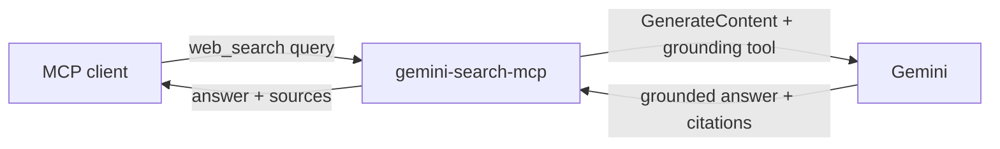
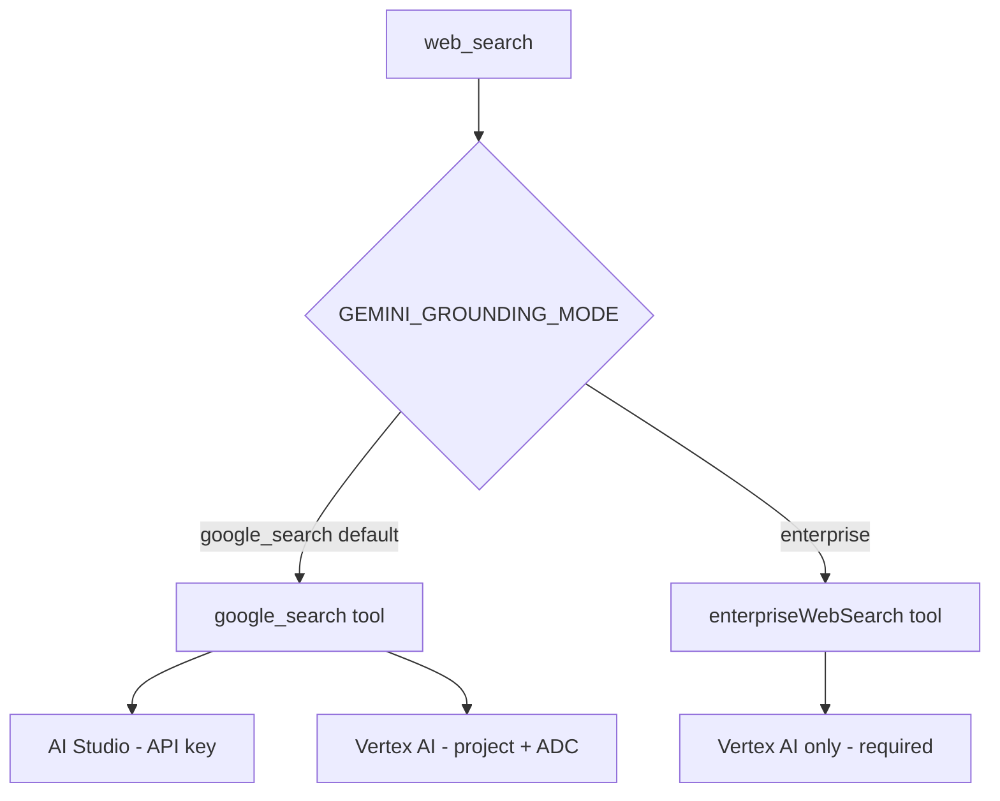

<!-- repo:managed -->
# gemini-search-mcp

An MCP server that gives your assistant one tool: `web_search`. Ask a
question, and it runs a Google search through Gemini, reads the results, and
hands back a written answer with the sources it used. The model does the
searching and the reading; you get the answer and the links.

It talks to Gemini one of two ways: through Vertex AI (your Google Cloud
project) or through AI Studio (an API key). Pick whichever you already have.
On Vertex AI it can also use **Web Grounding for Enterprise**, Google's
compliance-grade grounding tool — see [Grounding modes](#grounding-modes).

## How it works



The server speaks MCP over stdio, so any MCP client can launch it as a
subprocess and call the tool. Which grounding tool it hands to Gemini depends
on the [grounding mode](#grounding-modes).

## Install

With Go:

```sh
go install github.com/cwest/gemini-search-mcp@latest
```

That drops a `gemini-search-mcp` binary in your `$GOBIN` (usually
`~/go/bin`). Make sure that's on your `PATH`.

Prefer a prebuilt binary? Grab one from the
[releases page](https://github.com/cwest/gemini-search-mcp/releases),
extract it, and put it somewhere on your `PATH`.

## Configuration

The server reads everything from the environment. It checks for Vertex AI
first; if that isn't set up, it falls back to AI Studio. If neither is
configured, it exits at startup with a message telling you what's missing.

### Vertex AI

Use this if you have a Google Cloud project with Vertex AI enabled.

| Variable | Required | Notes |
| --- | --- | --- |
| `GOOGLE_GENAI_USE_VERTEXAI` | one of these | Set to `true` to force Vertex. |
| `GOOGLE_CLOUD_PROJECT` | yes | Your project id. |
| `GOOGLE_CLOUD_LOCATION` | yes | e.g. `global` or `us-central1`. |
| `GOOGLE_APPLICATION_CREDENTIALS` | usually | Path to a service-account key file, unless you're already authenticated with application default credentials. |

Setting `GOOGLE_CLOUD_PROJECT` and `GOOGLE_CLOUD_LOCATION` together is enough
to select Vertex; the `GOOGLE_GENAI_USE_VERTEXAI` flag is there if you want to
be explicit.

### AI Studio

The quick path. Get a key from [AI Studio](https://aistudio.google.com/apikey).

| Variable | Required | Notes |
| --- | --- | --- |
| `GEMINI_API_KEY` | yes | Your AI Studio API key. `GOOGLE_API_KEY` works too. |

### Optional, either mode

| Variable | Default | Notes |
| --- | --- | --- |
| `GEMINI_SEARCH_MODEL` | `gemini-3.1-flash-lite` | The Gemini model to query. See [Which model?](#which-model) for why this is the default. |
| `GEMINI_SEARCH_TIMEOUT` | `30s` | Per-search deadline, as a Go duration (`45s`, `2m`). |
| `GEMINI_GROUNDING_MODE` | `google_search` | Which grounding tool to use: `google_search` (default) or `enterprise`. `enterprise` requires Vertex AI. See [Grounding modes](#grounding-modes). |

One caveat worth knowing: on Vertex AI the source list includes the domain for
each citation. On AI Studio that field comes back empty, so you'll see the page
title and URL but not a bare domain.

## Grounding modes

Grounding is *how* the model backs its answer with real web sources. This server
supports three distinct paths, selected by your provider and the
`GEMINI_GROUNDING_MODE` variable. The default is unchanged from earlier
versions: `google_search` on whichever provider you configured.



| Path | Provider | `GEMINI_GROUNDING_MODE` | What it is |
| --- | --- | --- | --- |
| AI Studio + Google Search | AI Studio (API key) | `google_search` | Grounding with Google Search, reached via an AI Studio API key. The quick path. |
| Vertex + Google Search | Vertex AI | `google_search` | The same Grounding with Google Search tool, reached through your Google Cloud project. |
| Vertex + Web Grounding for Enterprise | Vertex AI | `enterprise` | The `enterpriseWebSearch` tool: a compliance-grade grounding product with **no logging of your prompts or responses for product improvement, VPC Service Controls support, and a curated web index**. |

**These are three different things, and the distinction is real.** Reaching
Grounding with Google Search over a Vertex API path is *not* the same as Web
Grounding for Enterprise — "Vertex" alone does not make grounding "enterprise."
Enterprise grounding is a separate tool (`enterpriseWebSearch`) with different
data-handling guarantees, and it is available **only on Vertex AI**. Selecting
`GEMINI_GROUNDING_MODE=enterprise` without the Vertex provider fails fast at
startup with a message telling you what's required.

To use it, configure Vertex AI (see [Vertex AI](#vertex-ai) above — same
credentials, no new secrets) and set:

```sh
export GEMINI_GROUNDING_MODE=enterprise
```

For the product details, data-handling guarantees, and availability, see
[Web Grounding for Enterprise](https://cloud.google.com/vertex-ai/generative-ai/docs/grounding/web-grounding-enterprise?utm_campaign=CDR_0x5d16fa53_user-journey_b532564980&utm_medium=external&utm_source=blog).

### Enabling enterprise grounding

Web Grounding for Enterprise needs a Vertex AI project set up for it:

- **APIs enabled** on the project: **Vertex AI API** and the **Discovery Engine
  API** (the enterprise index is served through Discovery Engine).
- **A region with Gemini quota.** In testing, the `global` location was
  quota-dry (429 `RESOURCE_EXHAUSTED`); `us-central1` worked. Set
  `GOOGLE_CLOUD_LOCATION` to a region that has Gemini quota on your project.
- **A model served in that region.** Both `gemini-2.5-flash` and
  `gemini-3.5-flash` are generally available across regional and `global`
  endpoints; preview models tend to require `global`. Availability varies by
  model and region, so consult the canonical
  [Vertex AI locations documentation](https://cloud.google.com/vertex-ai/generative-ai/docs/learn/locations?utm_campaign=CDR_0x5d16fa53_user-journey_b532564980&utm_medium=external&utm_source=blog)
  rather than assuming, and set `GEMINI_SEARCH_MODEL` to a model available in
  your chosen region. In our testing, `gemini-2.5-flash` on `us-central1` worked.

A working combination for a Vertex project with the APIs above enabled:

```sh
export GOOGLE_GENAI_USE_VERTEXAI=true
export GOOGLE_CLOUD_PROJECT=your-project
export GOOGLE_CLOUD_LOCATION=us-central1
export GEMINI_SEARCH_MODEL=gemini-2.5-flash
export GEMINI_GROUNDING_MODE=enterprise
```

The live integration tests (`RUN_VERTEX_INTEGRATION=1`) default to this same
region/model combination so they run green out of the box; both env vars
override the defaults.

## Which model?

The default is `gemini-3.1-flash-lite`, and that's an evidence-based choice, not a
guess. We built an eval harness (see [`evals/`](evals/README.md)) that runs a golden
query set through several models and scores the answers with a *different* model
family as judge (`claude-opus-4-8` on Vertex, to avoid self-grading bias). When new
models GA, we re-run the sweep and publish the numbers here — including the ones that
argue *against* the default, and the vendor claims that didn't hold up.

### Latest sweep — the two GA'd models vs the default (2026-07-22)

`gemini-3.6-flash` and `gemini-3.5-flash-lite` went GA and are now routable, so we
re-ran the sweep against the current default (24 cases × 3 models = 72 cells, 0
errors). **The default does not change: `gemini-3.1-flash-lite` stays.** Full report,
methodology, and per-cell JSON:
[`evals/results/2026-07-22-default-model-sweep.md`](evals/results/2026-07-22-default-model-sweep.md).

| Model | Faithfulness (scored-n) | Citation F1 (P / R) (scored-n) | Relevance | Correctness | Source qual | Ungrounded (0-source) | p50 latency | Grounded tok/s (mean / median) | Avg tokens/query | $/1k queries* |
| --- | --- | --- | --- | --- | --- | --- | --- | --- | --- | --- |
| **gemini-3.1-flash-lite** (default) | 0.90 (n=20) | 0.49 (0.94 / 0.33) (n=17) | 0.91 | 0.82 | **0.59** | **4/24 (17%)** | 2810 ms | 90 / 89 | **328** | **$0.48** |
| gemini-3.6-flash | 0.90 (n=10) | **0.60 (0.97 / 0.43)** (n=10) | 0.92 | **0.84** | 0.35 | 13/24 (54%) | 2330 ms | 99 / 81 | 375 | $2.59 |
| gemini-3.5-flash-lite | 0.79 (n=13) | 0.47 (0.89 / 0.32) (n=12) | **0.93** | 0.83 | 0.36 | 11/24 (46%) | **2162 ms** | **110** / 79 | 326 | $0.73 |

\* Token cost only, at official Vertex Standard-tier Global list prices. It excludes
the flat grounded-search surcharge (~$35 / 1k grounded prompts beyond the free tier),
which is identical per prompt across all three models and dominates absolute cost.

**That "0.90 = 0.90 faithfulness tie" is not a real tie — it's a denominator
artifact.** Faithfulness and Citation F1 are N/A on any cell that returns zero
sources, and the three models return sources on *different* cases, so those column
averages sit on different case counts (the scored-n in each cell). Restricted to the
**10 cases where all three models actually returned sources** (apples-to-apples):

| Model | Faithfulness (n=10) | Citation F1 (P / R) (n=9) |
| --- | --- | --- |
| **gemini-3.1-flash-lite** (default) | **0.934** | 0.476 (0.92 / 0.32) |
| gemini-3.6-flash | 0.905 | **0.610 (0.97 / 0.44)** |
| gemini-3.5-flash-lite | 0.810 | 0.474 (1.00 / 0.31) |

On identical inputs the default **leads** faithfulness (0.934 > 0.905 > 0.810), and
`gemini-3.6-flash`'s one real quality win — citation recall / F1 — survives the
common-subset cut (F1 0.61 vs 0.48).

**The ungrounded rate is itself a first-order result for a grounded-search tool.**
`gemini-3.6-flash` answered from parametric knowledge with **zero** sources on 13/24
cases (54%) — including `speed-of-light`, `boiling-point-water`, and
`tallest-mountain` — versus 4/24 (17%) for the default. For a tool whose whole job is
grounded citation, answering half the queries without searching is the strongest
single argument against 3.6-flash.

**Two vendor claims that motivated the eval did *not* reproduce in this workload:**

- **"~350 tok/s for Lite" — not reproduced.** Measured end-to-end grounded throughput
  for `gemini-3.5-flash-lite` was **~110 tok/s mean, ~79 tok/s median** — ~3× below
  the claim. (Caveat: these are grounded search calls, so wall-clock includes retrieval
  and the redirect hop, not pure decode. Lite *is* the fastest on p50 latency, 2162 ms.)
- **"~17% token efficiency for 3.6-Flash" — not reproduced (opposite sign).**
  `gemini-3.6-flash` used **+14.3%** *more* tokens per query than the default, not
  fewer (375 vs 328). Combined with its higher per-token output price, its token cost
  per query is **~5.4×** the default. (`ThinkingBudget=0` is enforced for all models,
  so 3.6-Flash's thinking capability is neutralized in this fast-grounded config —
  consistent methodology, but the efficiency claim doesn't transfer to this use case.)

The judge for this run is κ-validated against an independent human label set: relevance
κ=1.00, source_quality κ=1.00, correctness κ=0.86 — all clear the κ>0.6 trust bar.

**Conclusion: keep `gemini-3.1-flash-lite` as the default.** Neither new model beats
it on the core quality axes at a price worth paying — the default leads faithfulness
and source quality and grounds far more reliably. Choose `gemini-3.6-flash` only if
citation recall is a product priority worth ~5× the token cost.

### Prior sweep (2026-07-12) — how the default was first chosen

The original sweep that set the default compared it against `gemini-3.5-flash` and
`gemini-3.1-pro-preview`:

| Model | Relevance | Correctness | Source quality | Faithfulness | Cite P/R | p50 latency | $/1k queries |
| --- | --- | --- | --- | --- | --- | --- | --- |
| **gemini-3.1-flash-lite** | **0.92** | **0.87** | **0.53** | **0.92** | **0.97 / 0.31** | **2.5 s** | **$0.69** |
| gemini-3.5-flash | 0.88 | 0.82 | 0.33 | 0.84 | 0.87 / 0.35 | 3.2 s | $2.98 |
| gemini-3.1-pro-preview | 0.71 | 0.69 | 0.34 | 0.78 | 0.86 / 0.38 | 11.0 s | $49.76 |

Flash-Lite matched or beat the larger models on quality while being far faster and
cheaper — because for grounded search, answer quality comes mostly from Google
Search, not from model size.

The full numbers, methodology, κ-validation, and instructions to reproduce or extend
the harness are in [`evals/README.md`](evals/README.md). Pick a different model with
`GEMINI_SEARCH_MODEL` if your workload disagrees — and if you do, run the eval and
tell us what you found.

## The web_search tool

**Input:**

| Field | Type | Description |
| --- | --- | --- |
| `query` | string | What you want to know, in plain language. |

**Output.** The tool returns markdown text: the answer, then a numbered list of
sources, then the searches Gemini actually ran. It also returns the same data
in structured form (`answer`, `sources`, `queries`) for clients that prefer to
parse it.

A response looks roughly like this:

```text
Go 1.26.4 is the latest stable release.

Sources:
1. go.dev — Go Downloads
   https://go.dev/dl/
2. endoflife.date — Go EOL
   https://endoflife.date/go

Searches run: latest Go version
```

If a search fails, the tool returns an error result with the reason instead of
crashing the server, so the session stays alive for the next call.

## Register it with a client

For Claude Code:

```bash
claude mcp add -s user gemini-search -- gemini-search-mcp
```

Your client launches the binary and passes the environment through, so set the
provider variables (above) wherever that client reads its environment.

Any MCP client works the same way: point it at the `gemini-search-mcp` binary
and let it run over stdio.

## Claude Code plugin

Instead of registering the server by hand, install `gemini-search-mcp` as a
Claude Code plugin. The plugin auto-registers the MCP server and ships a skill
that steers the model to prefer this tool for web search.

The plugin lives in this repository, so point Claude Code at it with
`--plugin-dir`:

```bash
claude --plugin-dir /path/to/gemini-search-mcp
```

(Or add it to a marketplace and `claude plugin install gemini-search@<marketplace>`.)

### Fetch the binary

The plugin's MCP config launches `${CLAUDE_PLUGIN_ROOT}/bin/gemini-search-mcp`,
so download a release binary into the plugin's `bin/` first:

```bash
scripts/install-plugin-binary.sh           # latest release
scripts/install-plugin-binary.sh v0.2.0    # a specific tag
```

The script detects your OS and architecture, downloads the matching GoReleaser
archive from the [releases page](https://github.com/cwest/gemini-search-mcp/releases),
verifies it against `checksums.txt`, and extracts the binary into `bin/`. When
Claude Code runs it, `CLAUDE_PLUGIN_ROOT` is already set; running it by hand
installs next to the plugin instead.

### Set the provider environment

The plugin does **not** ship any credentials — you supply your own. Set either
the Vertex AI variables (`GOOGLE_GENAI_USE_VERTEXAI`, `GOOGLE_CLOUD_PROJECT`,
`GOOGLE_CLOUD_LOCATION`, and usually `GOOGLE_APPLICATION_CREDENTIALS`) or an AI
Studio key (`GEMINI_API_KEY`) in the environment Claude Code launches from. See
[Configuration](#configuration) for the full list.

To make Claude Code prefer this tool over the built-in `WebSearch`, add
`"permissions": {"deny": ["WebSearch"]}` to your settings. For that and for
steering other agents (Gemini CLI, opencode, OpenAI-compatible clients), see
[docs/prefer-web-search.md](docs/prefer-web-search.md).

## Learn more

- [Grounding with Google Search](https://ai.google.dev/gemini-api/docs/google-search?utm_campaign=CDR_0x5d16fa53_awareness_b532564501&utm_medium=external&utm_source=lab)
  — the Gemini API feature this server is built on.
- [Web Grounding for Enterprise](https://cloud.google.com/vertex-ai/generative-ai/docs/grounding/web-grounding-enterprise?utm_campaign=CDR_0x5d16fa53_user-journey_b532564980&utm_medium=external&utm_source=blog)
  — the compliance-grade grounding tool behind `GEMINI_GROUNDING_MODE=enterprise`.
- This project has a companion write-up series:
  <!-- SERIES-SLUG-PLACEHOLDER: fill with the live slug when Part 1 publishes; a backlink to an unpublished post would 404. -->
  <https://caseywest.com/SERIES-SLUG-PLACEHOLDER>

## Contributing

See [CONTRIBUTING.md](CONTRIBUTING.md) and our [Code of Conduct](CODE_OF_CONDUCT.md).

## License

This project is licensed under the [Apache-2.0 License](LICENSE).
