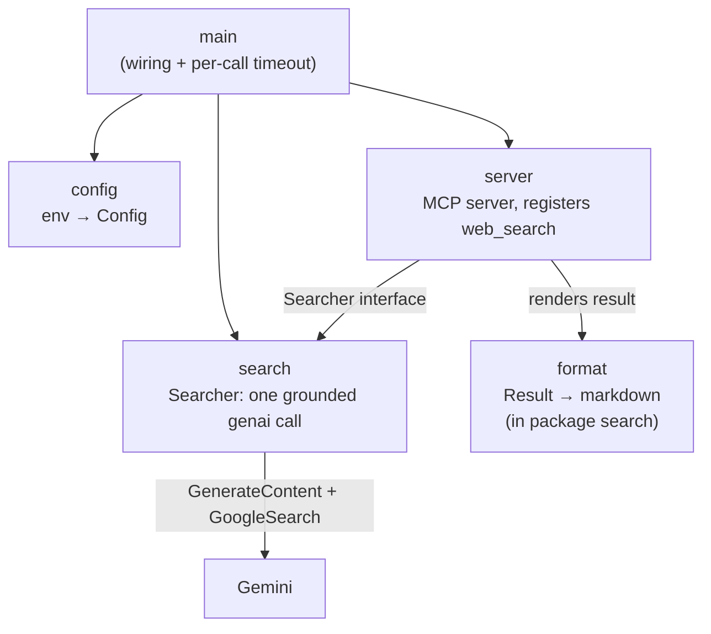
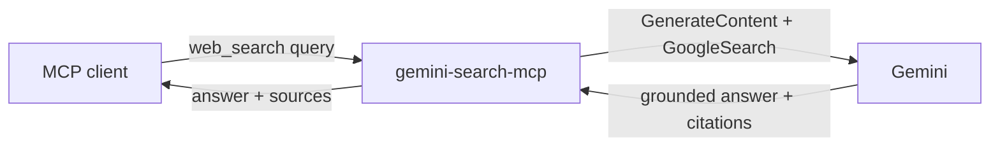

# Architecture

This document explains what `gemini-search-mcp` is, the design choices behind it, and how a query flows through the system. It is deliberately lean: the code is small, and the deeper story — why grounded search matters, how capability governance works, and how the model choice was evaluated — lives in the blog series linked at the end.

## Overview

`gemini-search-mcp` is a single Go binary that speaks the Model Context Protocol (MCP) over stdio and exposes exactly one tool: `web_search`. A client sends a natural-language query; the server asks Gemini to answer it with Google Search grounding, then hands back a synthesized answer together with the sources the model actually consulted.

The server talks to Gemini through one of two backends, auto-detected from the standard environment: a Google Cloud project (grounding on the Gemini Enterprise Agent Platform) or an AI Studio API key. The application code does not care which — the backend is resolved by the underlying `genai` SDK from the ambient credentials, so the same binary serves both paths.

The design goal is narrow on purpose. One tool, one responsibility, no framework, no persistent state. The value is in the grounding round-trip and the honest source list, not in surface area.

## Why Go

Go was chosen for three properties that matter to a tool a client launches as a subprocess:

- **A single static binary.** `go install` or a released archive drops one self-contained executable on the `PATH`. There is no interpreter to match, no virtual environment to activate, and no dependency tree to resolve at run time.
- **Fast cold start.** An MCP client spawns the server as a child process and expects it to be ready almost immediately. A compiled binary starts in milliseconds, which keeps tool invocation cheap.
- **A first-class MCP SDK.** The official Go MCP SDK models the protocol directly, so tool registration and the stdio transport are a few lines rather than a hand-rolled framing layer.

The trade-off — Go's smaller data-science ecosystem relative to Python — does not bite here, because the intelligence lives in Gemini, not in the process. The binary's job is to marshal a request, make one grounded call, and format the result.

## Why Not a Framework (ADK)

An agent framework such as the Agent Development Kit (ADK) is a natural thing to reach for, and it is a good fit for a different shape of problem. ADK-Go is built to *consume* MCP tools inside an agent it orchestrates; it is not designed to *expose* a tool as a standalone MCP server for other clients to call. A prototype confirmed the mismatch: wrapping this one-tool server in an agent framework added a runtime and a programming model without changing the single call the tool makes.

This is not a knock on ADK — the two solve different problems, and they are better together. ADK is where you assemble an agent that calls many tools; a focused MCP server like this one is a tool that many agents (including ADK-based ones) can call. The right architecture for "publish one grounded-search tool over stdio" is a small binary that speaks MCP directly, so that is what this is.

## Component Split

The code is organized as a thin wiring layer over four small components, each with one job. `main` composes them; nothing else knows about the others beyond a narrow interface. Three of the four are their own internal package (`config`, `search`, `server`); `format` lives alongside `search` in the same package, kept in a separate file because it is a distinct responsibility rather than a distinct dependency.

- **`config`** reads the environment and returns a validated `Config` (provider, model, per-search timeout). It fails fast with a clear message when no usable backend is configured, so a misconfiguration surfaces at startup rather than deep inside an API call.
- **`search`** owns the single grounded call. It defines the `Searcher` interface, issues one `GenerateContent` request with the Google Search tool enabled, retries transient failures (rate limits and server errors) with exponential backoff, and maps the response into a `Result` of answer, sources, and the searches the model ran.
- **`format`** turns a `Result` into the markdown text returned over MCP — the answer, a numbered source list, and the queries Gemini executed. It sits in its own file so presentation logic stays separate from the grounded call, even though both live in the `search` package.
- **`server`** builds the MCP server and registers `web_search`. It depends only on the `Searcher` interface, which is what makes the whole tool testable without a live backend: tests inject a stub searcher and assert on the tool's behavior.

`main` wires the four components together and wraps the searcher with a per-call deadline. Because `server` depends on an interface rather than a concrete client, the boundaries stay honest and the seams are all testable.

## Grounding Data Flow

A single `web_search` call is one round-trip. The client sends a query; the server asks Gemini to answer it with Google Search grounding; Gemini runs the searches, reads the results, and returns a grounded answer with citations; the server formats that into markdown and returns it — along with the same data in structured form for clients that prefer to parse it.

The model does the searching and the reading; the caller gets the answer and the links. If a search fails, the tool returns an error result with the reason rather than crashing the server, so the session stays alive for the next call.

## Why This Exists / Read More

Grounded search is a small, sharp example of a bigger idea: giving a model a real capability is an informed choice an organization gets to make and govern, not an all-or-nothing switch. That framing — capability governance as a deliberate, controllable decision, with the model provider and the platform *better together* rather than in tension — is the throughline of the blog series this repository accompanies. The series is the canonical narrative: the governance thesis, the evaluation rigor behind the default model choice, and the reasoning this document only summarizes.

- **The story behind this project** — the [caseywest.com blog series](https://caseywest.com/), which covers the why in full.
- **Grounding with Google Search on Google Cloud** — the [grounding overview](https://cloud.google.com/vertex-ai/generative-ai/docs/grounding/overview?utm_campaign=CDR_0x5d16fa53_platform&utm_medium=external&utm_source=lab), the platform documentation for the capability this tool puts one call away.

For the model-selection evidence — the eval harness, the golden query set, and the cross-family judging that makes the default an evidence-based choice rather than a guess — see [`evals/README.md`](../evals/README.md).
